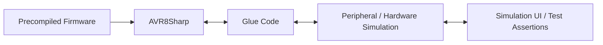

# AVR8Sharp


[](https://www.nuget.org/packages/AVR8Sharp)
[](https://github.com/begeistert/avr8sharp/blob/master/LICENSE)

**AVR8Sharp** is a .NET library that emulates the AVR 8-bit microcontroller family. It is a port of the [avr8js](https://github.com/wokwi/avr8js) library originally written in TypeScript, with additional accuracy fixes and C#-specific optimizations.

The library executes precompiled AVR firmware and provides a configurable peripheral layer for simulating the microcontroller's I/O — suitable for unit testing firmware, building interactive simulators, or running automated hardware-in-the-loop style tests without physical hardware.



## Installation

```bash
dotnet add package Avr8Sharp
```

## Usage

The library uses a **builder pattern** to configure the CPU, clock speed, and peripherals. The example below loads a HEX file and runs it as an Arduino Uno (ATmega328P), printing any bytes sent over the USART serial port.

```csharp
using AVR8Sharp.Core;
using AVR8Sharp.Core.Peripherals;

// Load firmware from an Intel HEX file
var hex = File.ReadAllText("firmware.hex");

// Build the simulation
var runner = AvrBuilder.Create()
    .SetSpeed(16_000_000)          // 16 MHz clock
    .SetWorkUnitCycles(500_000)    // cycles to execute per Execute() call
    .SetHex(hex)
    .AddGpioPort(AvrIoPort.PortBConfig, out _)
    .AddGpioPort(AvrIoPort.PortCConfig, out _)
    .AddGpioPort(AvrIoPort.PortDConfig, out _)
    .AddUsart(AvrUsart.Usart0Config, out var usart)
    .AddTimer(AvrTimer.Timer0Config, out _)
    .AddTimer(AvrTimer.Timer1Config, out _)
    .AddTimer(AvrTimer.Timer2Config, out _)
    .Build();

// Print every line the firmware sends over serial
var line = new StringBuilder();
usart.OnByteTransmit = b => {
    var c = (char)b;
    line.Append(c);
    if (c != '\n') return;
    Console.WriteLine(line.ToString().TrimEnd());
    line.Clear();
};

// Run the simulation loop
while (true)
{
    runner.Execute();
}
```

The snippet above will run the following Arduino sketch:

```cpp
void setup() {
    Serial.begin(115200);
    pinMode(LED_BUILTIN, OUTPUT);
}

void loop() {
    Serial.println("AVR8Sharp is awesome!");
    digitalWrite(LED_BUILTIN, HIGH);
    delay(500);
    digitalWrite(LED_BUILTIN, LOW);
    delay(500);
}
```

### Peripherals

All peripherals are optional and added via the builder. Each peripheral exposes callbacks and properties for interacting with the simulation from the host:

| Peripheral | Builder method | Key callbacks / properties |
|---|---|---|
| GPIO port | `AddGpioPort` | `SetPinValue`, `GetPinState`, `AddListener` |
| USART | `AddUsart` | `OnByteTransmit`, `WriteByte` |
| Timer | `AddTimer` | `OnOutputCompareMatch`, timer OC pins |
| SPI | `AddSpi` | `OnTransfer`, `SimulateIncomingMasterByte` |
| TWI (I2C) | `AddTwi` | `EventHandler`, `SimulateIncomingAddress`, `SimulateIncomingData` |
| ADC | `AddAdc` | `ChannelValues[]`, `TemperatureVoltage` |
| EEPROM | `AddEeprom` | `EepromMemoryBackend` |
| USI | `AddUsi` | `OnStartCondition`, `OnStopCondition` |

### Decoders

Three instruction decoders are available. The default (`NativeLut`) is the fastest:

```csharp
AvrBuilder.Create()
    .UseNativeDecoder()   // unsafe function-pointer LUT — fastest (default)
    // .UseLutDecoder()   // delegate LUT — portable
    // .UseSwitchDecoder() // switch/case — simplest
    ...
```

## Supported Chips

AVR8Sharp targets the ATmega328P by default and includes pre-built configurations for:

- **ATmega328P** — Arduino Uno/Nano (Timers 0–2, USART0, SPI, TWI, ADC)
- **ATmega2560** — Arduino Mega (adds Timers 3–5, USART1–3)
- **ATtiny85** — USI, Timer0/1

Because the peripheral register addresses are fully configurable, most AVR 8-bit devices can be modelled by supplying the appropriate register map.

## Testing

```bash
dotnet test
```

## License

Copyright (c) 2019-present Uri Shaked.

Copyright (c) 2025-present Iván Montiel.

Licensed under the [MIT License](LICENSE).
